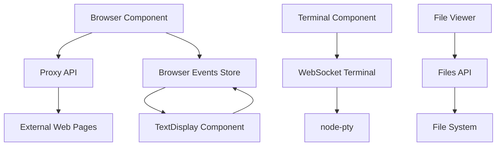

# AGENTS.md
This file provides guidance to Verdent when working with code in this repository.

## Table of Contents
1. Commonly Used Commands
2. High-Level Architecture & Structure
3. Key Rules & Constraints
4. Development Hints

## Commands
- `pnpm dev` - Start development server with WebSocket terminal support (port 3015)
- `pnpm build` - Build for production
- `pnpm start` - Start production server (port 3015)
- `pnpm lint` - Run ESLint linting
- `pnpm type-check` - Run TypeScript type checking
- `pnpm install` - Auto-builds node-pty native module via postinstall script

## Architecture

### Major Subsystems
- **Browser Component**: iframe-based web browser with proxy functionality for CORS handling
- **Terminal Component**: XTerm.js terminal emulator with session-based command execution
- **TextDisplay Component**: Real-time browser event monitoring and display system
- **API Layer**: Two main REST endpoints (`/api/files`, `/api/proxy`) plus WebSocket terminal at `/api/terminal/websocket`
- **State Management**: Zustand for browser events, nuqs for tab state persistence

### Key Data Flows
- **Browser Events**: iframe → PostMessage → Browser component → Zustand store → TextDisplay
- **Terminal Commands**: XTerm UI → WebSocket `/api/terminal/websocket` → node-pty → Terminal display
- **Web Proxy**: Browser → `/api/proxy` → External fetch → HTML injection → iframe
- **File System**: Requests → `/api/files` → Node.js fs operations → JSON response

### External Dependencies
- **XTerm.js**: Terminal emulation with VS Code theming
- **node-pty**: Native terminal sessions with WebSocket integration
- **Radix UI**: Accessible component primitives
- **React Resizable Panels**: Layout management for desktop view
- **Tailwind CSS 4.x**: Styling framework
- **Zustand**: Lightweight state management

### Development Entry Points
- Main layout: `app/page.tsx` (responsive layout with mobile tabs/desktop panels)
- Components: `app/browser.tsx`, `app/terminal.tsx`, `app/text-display.tsx`
- APIs: `app/api/files/route.ts`, `app/api/proxy/route.ts`, WebSocket terminal in `server.js`

### Subsystem Relationships

## Key Rules & Constraints

### From tsconfig.json
- Strict TypeScript mode enabled
- ES2017 target with bundler module resolution
- Path aliases: `@/*` maps to repository root

### From next.config.ts
- Custom webpack/turbopack rules for `.md` files using raw-loader
- Image security policies with CSP: `default-src 'self'; script-src 'none'; sandbox;`
- Remote images allowed only from Vercel avatar API

### From package.json & Architecture
- Project name: "vibe-coding-agent" [inferred: coding environment platform]
- Uses pnpm workspace configuration
- React 19.1.0 with Next.js 15.4.5 App Router

### Security Constraints [inferred]
- Terminal WebSocket sessions isolated by session ID
- File API validates paths to prevent traversal
- Browser iframe uses sandbox attributes
- Proxy API injects event capture scripts safely
- Native module compilation required for node-pty (auto-handled by postinstall)

## Development Hints

### Adding a New API Endpoint
- Create route handler in `app/api/[name]/route.ts`
- Use Next.js App Router patterns with named exports (GET, POST, etc.)
- Follow existing patterns for error handling and validation
- Consider security implications (path validation, command filtering)

### Modifying CI/CD Pipeline
- No specific CI/CD configuration found in repository
- Standard Next.js deployment patterns apply
- Use `pnpm build` for production builds

### Extending Subsystems
- **Browser**: Modify `app/browser.tsx` and proxy API for new navigation features
- **Terminal**: Extend `app/terminal.tsx` and WebSocket handling in `server.js` for new command features
- **Events**: Update Zustand store in `store/browser-events.ts` for new event types
- **UI Components**: Follow Radix UI + Tailwind patterns in `components/ui/`
- **File Operations**: Extend `/api/files` route for new file system capabilities

### Component Development
- Follow existing component structure in `components/` directory
- Use Radix UI primitives for accessibility
- Implement responsive design with mobile tabs and desktop panels
- Use Tailwind CSS with established design system
- For terminal features, reference XTerm.js documentation and existing VS Code theme implementation